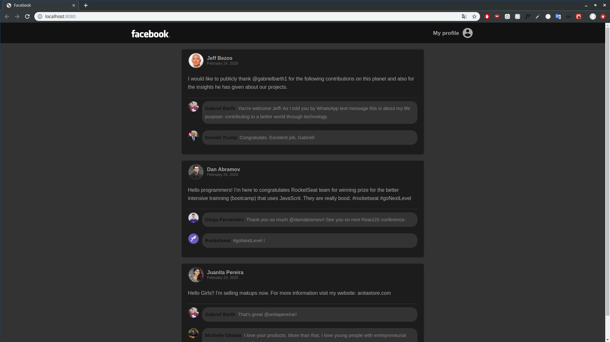
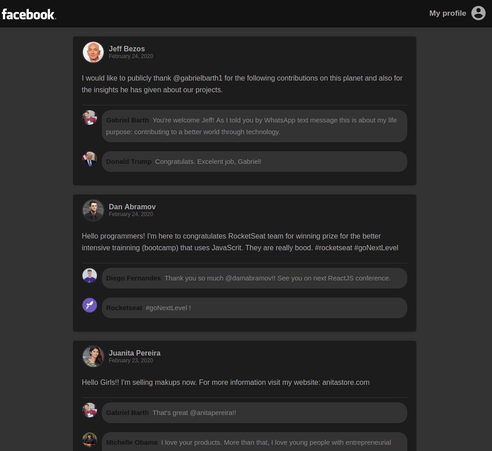

# darkFacebook


:us: 
<br>
Front-end application (ReactJS) to simulate Facebook interface (but in dark mode). It was developed during GoStack10 bootcamp challange 04.
<br>
<br>
<span>&#x1f1e7;&#x1f1f7;</span>
<br>
Aplicação para simular a interface do Facebook desenvolvida com ReactJS, desenvolvida durante o desafio 04 do bootcamp GoStack10.

##  :mag_right: Main points covered in this stage / Principais pontos
:us: 
<br>
ReactJS has basicaly two forms most used to manipulate content inside a component: class method and function method.
For aplications already existents (created in june/2019 or before) is used class method.
Meantime, for most recently reactJS applications is most used function method (and react hooks).

Older reactJS application has the concept of life cycle of a componente through well-known methods. 
We could have commonly three of these methods:
- **componentDidMount():** executed at same time that component appears on screen;
- **componentDidUpdate():** executed whenever there are changes in the properties or state of the component;
- **componentWillUnmount():** executed when component ceases to exist (component dies).

When using class component, there are other interesting point in ReactJS: it's very common to use arrow functions. It allows to access the THIS of class scope. 
Enables to access other properties or funcions of class.

Another great reactJS concept discussed during the module module was the principle of immutability. 
To change a component state in ReactJS you can't update the current state, you need create a new state!
This is a great idea to avoid problems, and the setState() is the function that allows create a new state.

<span>&#x1f1e7;&#x1f1f7;</span>
<br>
ReactJS tem basicamente duas formas mais usadas para manipular conteúdo dentro de um componente: class ou function().
Para aplicações já existentes (criadas em junho / 2019 ou antes) é utilizado método de classe.
Ao mesmo tempo, para aplicações reactJS mais recentes é comumente usado functions (somado ainda com os react hooks).

Essas aplicações ReactJS mais antigas trazem a tona o conceito de ciclo de vida do componente através de métodos bem conhecidos. 
Nós temos basicamente três métodos mais comumente utilizados:
- **componentDidMount():** executado quando o componente é renderizado em tela;
- **componentDidUpdate():** executado sempre que houver alteração nas propriedades ou no estado do componente;
- **componentWillUnmount():** executado quando o componente deixa de existir.

Quando o assunto é Class component, há outro ponto que merece destaque: é muito comum utilizar arrow functions. Seu uso permite acessar o THIS do escopo da classe
(e não somente daquele bloco de cógido em questão). Dessa forma é possível acessar as propriedades e outras funções da classe.

Outro ótimo conceito de ReactJS abordado ao longo do módulo é o princípio da imutabilidade.
Para mudar um estado de um componente você não pode atualizá-lo, mas apenas criar um novo estado!
Essa é uma boa ideia para evitar problemas. Para mudar o estado é necessário usar a função setState(),
para que dessa forma se cria um novo estado (mesmo que este possa contar com as informações do estado anterior).
<br>


##  :computer: View of interface / Visão da interface

<br>



<br>

##  :link: Project dependencies / Bibliotecas utilizadas

:ballot_box_with_check: **react**                `// react lib` <br>
:ballot_box_with_check:**react-dom**             `// allows to load react through <script> tag ` <br>
:ballot_box_with_check: **@material-ui/icons**             `// allows to use icons from material-ui lib`  <br>
:ballot_box_with_check: **@material-ui/core**          `//  necessary to use icons from material-ui lib` <br>
:ballot_box_with_check: **@babel/plugin-proposal-class-properties**          `// allows babel to interpret the leaner syntax (without the contructor for example)` <br>

**Development libs / Bibliotecas de desenvolvimento utilizadas no projeto:**
<br>
:ballot_box_with_check: **@babel/core**             `// babel compiler core` <br>
:ballot_box_with_check: **@babel/preset-env**            `// includes javascript syntax that brownser does not understand` <br>
:ballot_box_with_check: **@babel/preset-react**         `// interprets react syntax for the brownser (like jsx, etc..)` <br>
:ballot_box_with_check: **babel-loader**       `// allows to load babel (used in webpack.config -> rules)` <br>
:ballot_box_with_check: **css-loader**              `//  interprets @import and url() like import/require() and will resolve them.` <br>
:ballot_box_with_check: **file-loader**             `// resolves import/require() on a file into a url and emits the file into the output directory` <br>
:ballot_box_with_check: **style-loader**            `// Inject CSS into the DOM` <br>
:ballot_box_with_check: **webpack**             `// static module bundler for modern JavaScript applications` <br>
:ballot_box_with_check: **webpack-cli**       `// webpack-client` <br>
:ballot_box_with_check: **webpack-dev-server**    `//  allows to automatically render updates made to the code on the browser and allows the application to run on localhost` <br>

<br>
<h1 align="center">
    
</h1>

<h3 align="center">
  Desafio 4: Introdução ao React
</h3>

<p align="center">“Sucesso não é o resultado de um jogo, mas o destino de uma jornada”!</blockquote>

<p align="center">
  

  <a href="https://rocketseat.com.br">
    
  </a>

  

  <a href="https://github.com/Rocketseat/bootcamp-gostack-desafio-04/stargazers">
    
  </a>
</p>

<p align="center">
  <a href="#rocket-sobre-o-desafio">Sobre o desafio</a>&nbsp;&nbsp;&nbsp;|&nbsp;&nbsp;&nbsp;
  <a href="#-entrega">Entrega</a>&nbsp;&nbsp;&nbsp;|&nbsp;&nbsp;&nbsp;
  <a href="#memo-licença">Licença</a>
</p>

## :rocket: Sobre o desafio

Crie uma aplicação do zero utilizando **Webpack, Babel, Webpack Dev Server e ReactJS**.

Nessa aplicação você irá desenvolver uma **interface** semelhante com a do **Facebook** utilizando React.

As informações contidas na interface são **estáticas** e não precisam refletir nenhuma API REST ou back-end.

### Tela da aplicação


O layout não precisa ficar exatamente igual, você pode utilizar sua criatividade para modificar da maneira que preferir.

O mais importante é que todos elementos apareçam em tela.

O layout da aplicação está [nesse link](.github/layout.sketch) que pode ser aberto por essa ferramenta gratuita e online: https://www.figma.com/

### Componentes

Na imagem abaixo destaquei cada componente que você criará e abaixo da imagem está a descrição e responsabilidades de cada um:


**Header (Amarelo):** Responsável por exibir a logo e o link para acessar o perfil;

**PostList (Verde):** Responsável por armazenar os dados da listagem de post, esses dados devem ficar dentro do `state` do componente e não em uma variável comum, por exemplo:

```js
class PostList extends Component {
  state = {
    posts: [
      {
        id: 1,
        author: {
          name: "Julio Alcantara",
          avatar: "http://url-da-imagem.com/imagem.jpg"
        },
        date: "04 Jun 2019",
        content: "Pessoal, alguém sabe se a Rocketseat está contratando?",
        comments: [
          {
            id: 1,
            author: {
              name: "Diego Fernandes",
              avatar: "http://url-da-imagem.com/imagem.jpg"
            },
            content: "Conteúdo do comentário"
          }
        ]
      },
      {
        id: 2
        // Restante dos dados de um novo post
      }
    ]
  };
}
```

**Post (Vermelho):** Responsável por exibir os dados do post, esses dados devem vir através de uma propriedade recebida do componente PostList, ou seja, lá no PostList você terá algo assim:

```js
posts.map(post => <Post key={post.id} data={post} />);
```

**Comment (Azul):** Responsável por exibir um comentário. Os dados do comentário virão por uma propriedade do componente. Dentro do componente Post você terá um novo `.map` para listar os comentários do post:

```js
data.comments.map(comment => <Comment key={comment.id} data={comment} />);
```

## 📅 Entrega

Esse desafio **não precisa ser entregue** e não receberá correção, mas você pode ver o resultado do [código do desafio aqui](https://github.com/Rocketseat/bootcamp-gostack-desafio-04). Após concluir o desafio, adicionar esse código ao seu Github é uma boa forma de demonstrar seus conhecimentos para oportunidades futuras.

## :memo: Licença

Esse projeto está sob a licença MIT. Veja o arquivo [LICENSE](LICENSE.md) para mais detalhes.

---

Feito com ♥ by Rocketseat :wave: [Entre na nossa comunidade!](https://discordapp.com/invite/gCRAFhc)
